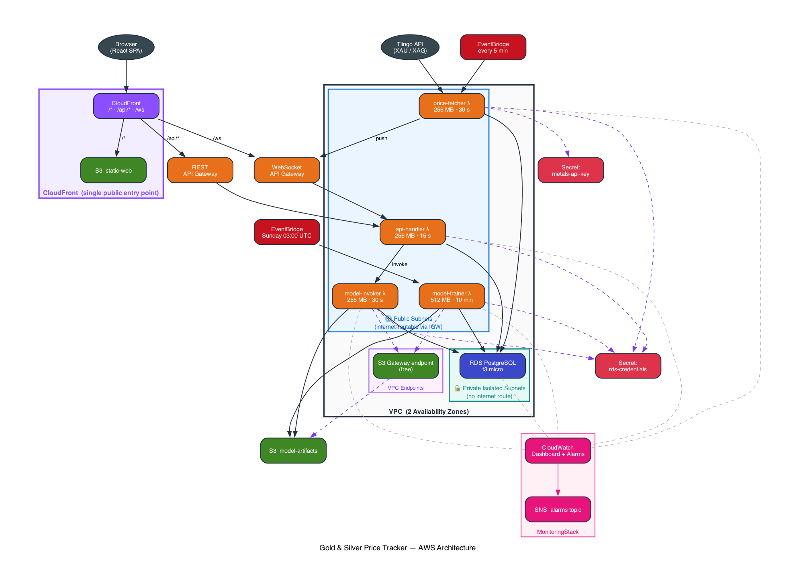
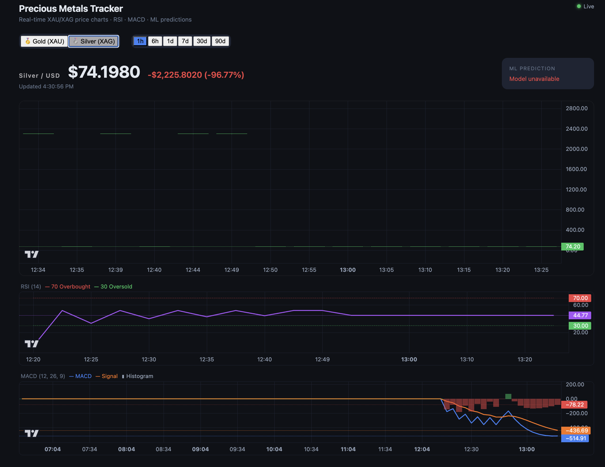

# Gold & Silver Price Tracker

A full-stack AWS application that tracks XAU/XAG spot prices in near real-time, displays interactive candlestick charts with RSI/MACD technical indicators, and provides ML-based price direction predictions.

## Architecture

```text
Tiingo API
    │
    ▼ (every 5 min)
EventBridge Scheduler ──► Lambda: price-fetcher ──► RDS PostgreSQL (t3.micro)
                                                           │
                     EventBridge (weekly) ──► Lambda: model-trainer ──► S3: model-artifacts
                                                           │
                          Browser ──► CloudFront ──► S3: static-web (React SPA)
                                           │
                                           ▼
                                   REST API Gateway ──► Lambda: api-handler ──► RDS
                                                                  │
                                                        Lambda: model-invoker ◄── S3

                          Browser ──► WebSocket API Gateway ◄── Lambda: price-fetcher
```




## Prerequisites

- AWS CLI configured (`aws configure`)
- Node.js >= 18
- Python >= 3.12
- AWS CDK v2: `npm install -g aws-cdk`
- A free API token from [Tiingo](https://www.tiingo.com/)

## Project Structure

```
cs436/
├── infra/            # AWS CDK TypeScript — all infrastructure as code
├── lambdas/          # Python Lambda functions
│   ├── shared-layer/ # AWS Lambda Layer (psycopg2, boto3, db helper)
│   ├── price-fetcher/
│   ├── model-trainer/
│   ├── model-invoker/
│   └── api-handler/
└── frontend/         # React + Vite SPA
```

## Local Testing



To ensure system stability and minimize AWS costs during development, this project includes a comprehensive **Local Validation Suite**. This environment allows you to test the full data pipeline — from API ingestion to frontend visualization — without deploying a single resource to the cloud.

---

### Local vs. AWS Comparison

The local environment uses lightweight Python processes and Docker containers to mirror the production AWS architecture:

| AWS Service | Local Simulation | Purpose |
|---|---|---|
| Amazon RDS | PostgreSQL (Docker) | Persistent storage for OHLC prices and ML predictions |
| AWS Lambda | Native Python | Executes handler logic directly via the `api_emulator` and `scheduler` |
| API Gateway | FastAPI (Uvicorn) | Simulates REST endpoints and WebSocket handshakes |
| EventBridge | `scheduler.py` | Mimics 5-minute cron triggers to invoke the price-fetcher |
| Secrets Manager | `mock_aws.py` | Intercepts `boto3` calls to provide local DB credentials and API keys |
| CloudFront | Vite Proxy | Routes frontend `/api` requests to the local backend while handling CORS |

---

### Core Components

The following scripts in `/local-validation` drive the simulation:

**`api_emulator.py`**
A FastAPI server that packages incoming HTTP requests into the AWS Proxy Event format required by `api-handler`. It also manages a local WebSocket server to broadcast live price updates to the React frontend.

**`scheduler.py`**
A continuous loop that triggers the `price-fetcher` Lambda logic every 5 minutes, keeping the local database consistently updated with real market data from the Tiingo API.

**`mock_aws.py`**
Uses `unittest.mock` to patch `boto3.client`, allowing Lambdas to fetch secrets from local files. This keeps sensitive API keys outside the repository while remaining accessible to the code.

**`test_db.py`**
A utility script that injects bulk historical data (70+ bars) into the `ohlc_prices` table. This satisfies the minimum data requirements for calculating RSI and MACD indicators.

---

### Running the Validation Suite

1. **Start the database** — run `docker compose up -d` inside the `local-validation` folder to initialize the PostgreSQL container.
2. **Configure secrets** — ensure your Tiingo API key is present in the file referenced by `path-to-apikey.txt`.
3. **Launch the backend** — run `uvicorn api_emulator:app --port 8080` to start the API simulation.
4. **Start ingestion** — run `python scheduler.py` to begin the 5-minute price fetching cycle.
5. **Start the frontend** — run `npm run dev` in the `frontend` directory. The Vite proxy will automatically route all `/api` calls to your local emulator.


## Deployment

### 1. Bootstrap CDK (first time only)

```bash
cd infra
npm install
cdk bootstrap aws://YOUR_ACCOUNT_ID/YOUR_REGION
```

### 2. Deploy Storage Layer

```bash
cdk deploy StorageStack
```

This creates the VPC, RDS PostgreSQL instance, S3 buckets, the shared Lambda Layer, and Secrets Manager secrets.

### 3. Configure Secrets

After `StorageStack` deploys, add your Tiingo token to Secrets Manager:

```bash
aws secretsmanager put-secret-value \
  --secret-id metals-api-key \
  --secret-string '{"api_key":"YOUR_TIINGO_KEY"}'
```

### 4. Run Database Migration

Connect to the RDS instance using the outputted endpoint and run the SQL schema:

```bash
psql -h <rds-endpoint> -U postgres -d pricetracker -f infra/schema.sql
```

### 5. Deploy Compute & API Stacks

```bash
cdk deploy IngestionStack MlStack ApiStack
```

### 6. Build and Deploy Frontend

Retrieve the API URLs from the previous step and insert them into `frontend/.env.production`, then compile and deploy:

```bash
cd ../frontend
npm install
npm run build
cd ../infra
cdk deploy FrontendStack MonitoringStack
```

## API Endpoints

| Method | Path | Description |
|--------|------|-------------|
| GET | `/prices?metal=gold&range=7d` | OHLC price history |
| GET | `/predict?metal=gold` | ML direction prediction |
| GET | `/technical?metal=silver` | RSI + MACD indicators |
| WS | `wss://<ws-url>` | Real-time price stream (ping every 4 min) |

## Free Tier Usage

| Service | Limit | This App |
|---------|-------|----------|
| Lambda | 1M req/month | ~9K req/month |
| RDS t3.micro | 750 hrs/month | 744 hrs/month |
| S3 | 5 GB | < 100 MB |
| API Gateway | 1M calls/month | Low traffic |
| CloudFront | 1 TB transfer | SPA traffic |

> **Note:** AWS Secrets Manager costs $0.40/secret/month after the 30-day trial.

> **Note:** RDS t3.micro converts to standard hourly billing exactly 12 months after AWS account creation.

## Local Development

### Frontend

```bash
cd frontend
npm install
cp .env.example .env.local
# Fill in VITE_API_URL and VITE_WS_URL with your deployed endpoints
npm run dev
```
